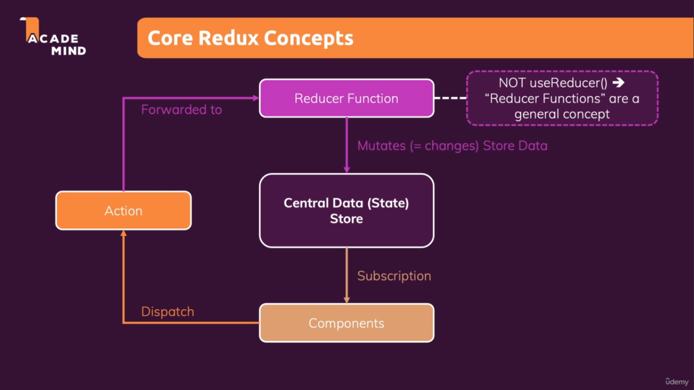

- components does not direct manupulate the data in the store'

reducer function : pure function (for same input get same output .... therefore no call for http, localstorage,)
    (preState, action) => return the state of the store

- redux : is independent package 
- react-redux is the bridge b/w them

- useSelector : select the part of the store/state object 
- useStore : get the whole part of the store 

- also set the subcription for the component
- useSelector helps in dom manipulation of the latest changes in the value

- useDispatch: used to dispatch action 